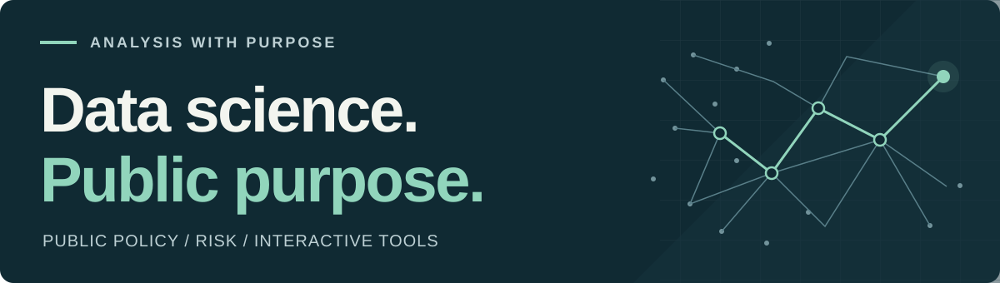

# Philippe Fontaine

**Data scientist · Public sector · France**

I turn complex administrative data into analysis and interactive tools for public decision-making. My work focuses on **policy evaluation, fraud detection and public finance**.

[Portfolio](https://www.philippefontaine.eu) · [LinkedIn](https://www.linkedin.com/in/philippe-fontaine-ds) · [Résumé](https://www.philippefontaine.eu/img/resume/cv_public.pdf) · [Email](mailto:philippe.fontaine.ds@proton.me)

## What I work on

- **Policy evaluation** — Statistical modelling, forecasting and causal inference applied to public policy.
- **Risk & fraud analysis** — Rule-based and machine-learning approaches to identifying patterns in large administrative datasets.
- **Tools for decision-making** — Analytical pipelines, Shiny applications and dashboards that make complex data easier to explore.

Most of my professional work is internal to public institutions. The personal projects below reflect my interest in public data and interactive analysis.

## Selected projects

### ThesisR

**Research & higher education** · `R` `Shiny`

Explore doctoral theses defended in France since 1985, across disciplines and institutions, to understand how the research landscape evolves.

[View source →](https://github.com/pds023/thesesfr)

### CIR

**Public policy & integration** · `R` `Shiny`

Explore the profiles of France's Republican Integration Contract signatories through interactive comparisons and visualisations.

[Live demo →](https://l023aq.shinyapps.io/minintCIR/) · [View source](https://github.com/pds023/minintCIR)

### SignalConso Explorer

**Consumer protection** · `R` `Shiny`

Interactive filters and charts for exploring consumer-report patterns. The repository includes synthetic data for local demonstrations.

[Live demo →](https://l023aq.shinyapps.io/shinySignalConso/) · [View source](https://github.com/pds023/shinysignalconso)

## Technical toolkit

| Area | Tools & methods |
| :--- | :--- |
| Languages | **R**, **Python**, **SQL** |
| Analysis | Statistical modelling, forecasting, causal inference, machine learning |
| Applications | Shiny, HTML, CSS, JavaScript |
| Workflow | Git, Linux, Jupyter, R Markdown |

I also explore **cybersecurity, data protection and OSINT**, with an interest in how they inform risk analysis in the public sector.

---

**Let's connect.** Interested in data science, risk analysis or tools for public policy? [Get in touch](mailto:philippe.fontaine.ds@proton.me) or [explore my portfolio](https://www.philippefontaine.eu).
